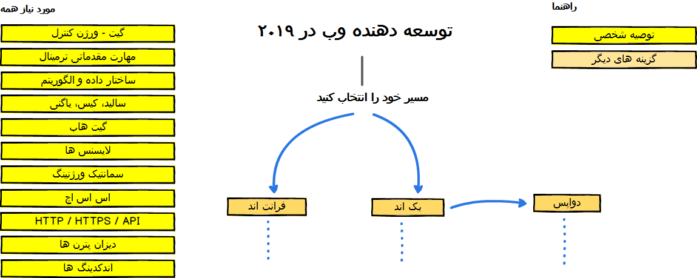
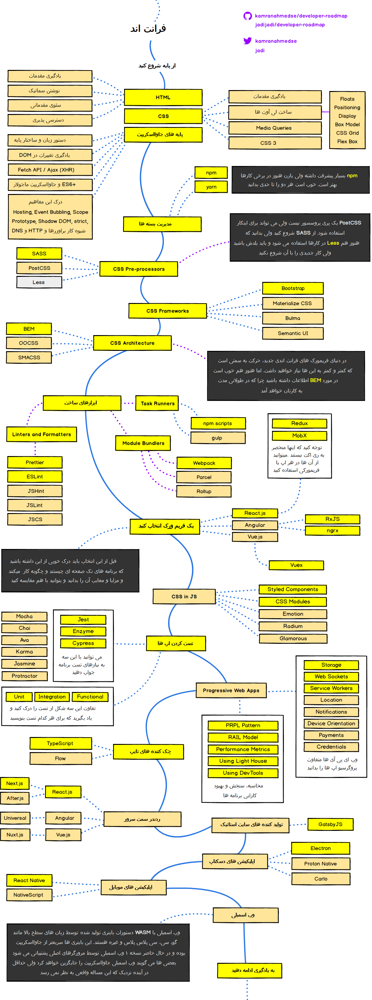
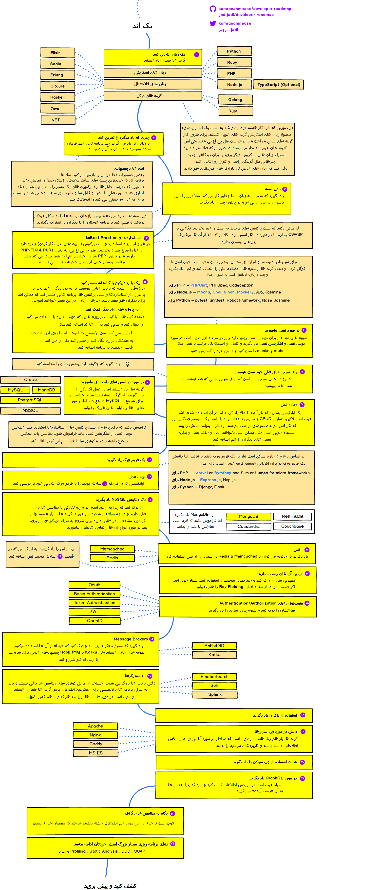
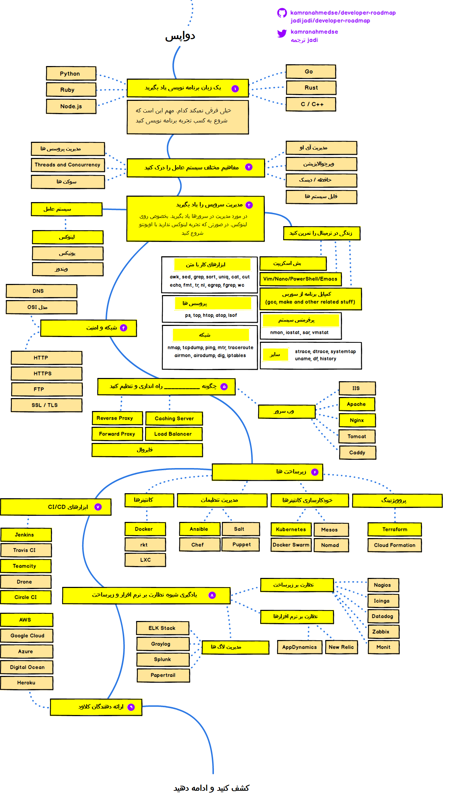

  
  <h2 align="center">نقشه راهی برای توسعه دهنده ها</h2>
  
چگونه در ۲۰۱۹ یک توسعه دهنده وب شویم

   

نمودارهایی که در اینجا مشاهده می‌کنید سعی می کنند مسیر یادگیری شما برای تبدیل شدن به یک توسعه دهنده حرفه ای بک اند، فرانت اند و دواپس را نمایش دهند. این نمودارها حاوی قدم ها، مسیر، تکنولوژی‌ها و مفاهیمی هستند که هر کدام از این متخصصان باید بدانند. 

این نمودارها توسط  کامران احمد (
[وبلاگ](http://kamranahmed.info) و [توییتر](https://twitter.com/kamranahmedse)) ساخته شده و توسط جادی ([وبلاگ](http://jadi.net) و [توییتر](http://twitter.com/jadi)) به فارسی ترجمه شده است.

## توجه
> هدف این نقشه راه ها نشان دادن مسیر به کسانی است که نمی دانند برای تبدیل شدن به یک توسعه دهنده بک اند، فرانت اند و دواپس باید چه مسیری را طی کنند. این راهنماها می توانند به آدم ها در یافتن جواب «در قدم بعد چه چیزی را یاد بگیرم» کمک کنند اما انتخاب صحیح تکنولوزی و مسیر وابسته به شرایط هر فرد بوده، فرمولی جهان شمول ندارد.

## مقدمه

## توسعه دهنده فرانت اند

## توسعه دهنده بک اند

## نقشه راه دواپس

## 🚦 تغییرات و پیشنهادها

صفحه اصلی پروژه [اینجاست](https://github.com/kamranahmed/developer-roadmap) ولی در صورت تمایل برای ایجاد اصلاحات در پروژه فارسی می توانید پی آر بفرستید. در صورت نیاز به تغییر جدی یا اضافه شدن تکنولوزی بهتر است اول آن را در ایشوها مطرح کنید. 

## حمایتگران پروژه اصلی

 - [**Hackr.io** - Best Online Programming Courses & Tutorials Recommended by the Programming Community](https://hackr.io)
 - [**Educative.io**: Become an employable Web Developer from scratch with this interactive learning track. Try a free preview today!](https://www.educative.io/track/beginning-front-end-developer)
 
## مجوز

